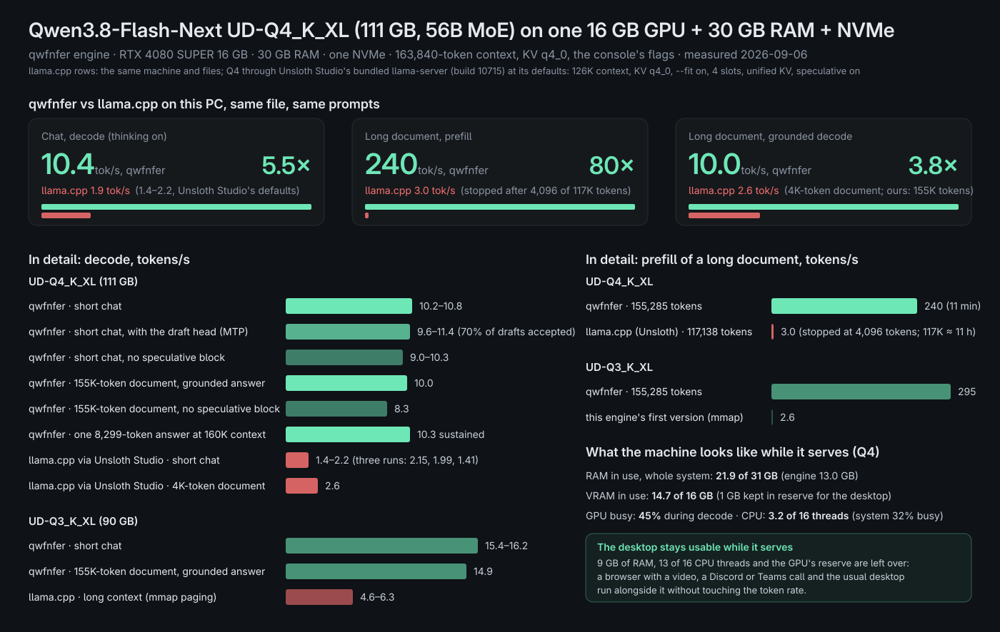
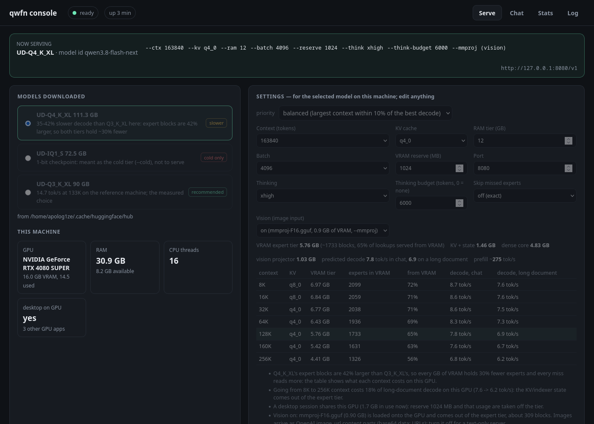

<div align="center">
  <h1>qwfnfer</h1>
  <p><b>Qwen3.8-Flash-Next — a 56B mixture-of-experts model, 512 experts, 111 GB on disk — at 160K context on one 16 GB GPU, 30 GB of RAM and an NVMe.</b></p>
</div>

<p align="center">
| <a href="#getting-started"><b>Getting Started</b></a> | <a href="#results"><b>Results</b></a> | <a href="#how-it-works"><b>How it works</b></a> | <a href="#built-around-the-qwen4-architecture"><b>Qwen4</b></a> | <a href="https://huggingface.co/unsloth/Qwen3.8-Flash-Next-GGUF"><b>Model (Unsloth GGUF)</b></a> |
</p>

Run a frontier-size open-weight MoE on the gaming PC you already own, at interactive speed: 12 tok/s in chat, 9 tok/s answering questions about a 155K-token document it read at 228 tok/s — with the desktop still usable next to it.

## About

qwfnfer is a purpose-built inference engine for Qwen3.8-Flash-Next (GGUF architecture `qwen4exp`): 48 layers, 512 routed experts with top-10 routing, DeltaNet recurrent layers and Qwen Sparse Attention. It is not a llama.cpp fork. It uses ggml's quantized kernels and CUDA backend and llama.cpp's tokenizer, and owns everything above them: the model graph, the memory hierarchy, the expert cache, prefill, the server and the console. Its core features:

- **Three-tier expert runtime**: experts live in VRAM, in pinned RAM and on the NVMe. Reads happen at an expert's natural 0.6–1.2 MB size over io_uring/O_DIRECT (23× the bandwidth of 4 KiB demand paging on the same disk), VRAM-resident experts compute inside replayed CUDA graphs, and the next layer's routing is predicted from the residual and prefetched while the current layer computes.
- **Long context that stays flat**: 163,840 tokens with q4_0 KV on 16 GB. Decode attention costs the same 0.55 ms per layer at 4K and at 160K (sparse attention over pooled block keys), and a layer-major prefill streams experts through VRAM at 228–273 tok/s instead of paging them.
- **OpenAI-compatible server**: streaming, thinking with `reasoning_effort` and a thinking budget, tool calling, vision, `/props`, `/stats`, `/slots`, `/metrics` and llama.cpp-style `timings` — works with Unsloth Studio, Open WebUI or any OpenAI client.
- **Console**: a local page that lists the downloaded quants, recommends settings for *your* GPU and model from a cost model fitted to measurements (context, KV type, RAM tier, reserve, with the whole context/speed trade-off shown), starts and stops the server, chats with it, and shows live tokens/s, prefill speed, cache hit rate and the endpoint.
- **Measured, not projected**: the forward pass is validated bit-exact against llama.cpp, and every number here is a real run on the reference machine, same file, same settings.

## Results

<div align="center">
  
</div>

Reference machine: RTX 4080 SUPER 16 GB, 30 GB RAM, one NVMe. 163,840-token context, KV q4_0, measured 2026-09-05.

| | UD-Q4_K_XL (111 GB) | UD-Q3_K_XL (90 GB) |
|---|---:|---:|
| short chat, decode | 11.8 tok/s | 16.8–19.1 tok/s |
| 155K-token document: prefill | 228 tok/s (11 min) | 273 tok/s |
| 155K-token document: decode, grounded answer | 9.3 tok/s | 14.5 tok/s |
| one 14,000-token answer at 160K context, sustained | 11.7 tok/s | — |
| llama.cpp on the same machine and file | 1.4–2.2 tok/s chat, 3 tok/s prefill (Unsloth Studio's defaults) | 4.6–6.3 tok/s at long context |

The table was measured before the speculative next-layer block became the default: on the same file and settings, replayed sequences decode 10-12% faster with it (12.1 → 13.5 tok/s in short chat, 9.3 → 10.1 tok/s at 44K context of a real document), the expert cache's prediction of the next layer's experts goes from 76-80% to 95-96%, and the output is unchanged. A later rewrite of the dense-core graph into the shapes ggml's CUDA backend fuses (its fused top-k router, GLU ops, adjacent norm and gamma, an outer-product combine, matmul reductions) took graph A down another 9% and decode at 44K context to 10.3-10.6 tok/s on the same replay, still exact against the CPU path.

While it serves Q4: 22 of 31 GB of RAM in use system-wide, 13.3 of 16 GB of VRAM, the GPU 70% busy, the engine on 3 of 16 threads. A browser with a video and a Discord or Teams call run alongside it without touching the token rate.

## Getting Started

**1. Get the model.** The console finds Qwen3.8-Flash-Next GGUFs in your Hugging Face cache. UD-Q4_K_XL is the quality choice, UD-Q3_K_XL the faster one; the `mmproj` file adds vision.

```bash
hf download unsloth/Qwen3.8-Flash-Next-GGUF --include "UD-Q4_K_XL/*" "mmproj-F16.gguf"
```

**2. Build once.** Needs CMake, Ninja, CUDA and a built [llama.cpp](https://github.com/ggml-org/llama.cpp) for the ggml backends and the tokenizer (default `~/.unsloth/llama.cpp`, override with `-DLLAMA_CPP_ROOT`):

```bash
cmake -B build -G Ninja -DCMAKE_BUILD_TYPE=Release && cmake --build build -j
```

**3. Open the console.**

```bash
scripts/console.sh
```

It opens http://127.0.0.1:8090. Pick a downloaded quant, keep the settings it recommends for your GPU and model (or edit them — the table shows what every context size costs in expert tier and tokens/s), leave vision on (it is on by default whenever the `mmproj` file is next to the model, and costs the expert tier about 1 GB of VRAM), and press **Start server**. The console runs the engine for you, names the model and every flag it is running with in the banner, chats with it, and shows live tokens/s, prefill speed, tokens served, cache hit rate and the endpoint. Stop it from the same page.

<div align="center">
  
</div>

**4. Point your tools at it.** The console shows the endpoint, `http://127.0.0.1:8080/v1` by default; any OpenAI-compatible client works with any API key (Unsloth Studio as a custom provider, Open WebUI, your own scripts). What the server accepts:

- Chat completions with streaming; the model id is `qwen3.8-flash-next`. Images go in as OpenAI content parts (base64 `data:` URLs) when vision is on, up to 4,096 image tokens each; a 1400×1000 screenshot is 1,364 tokens and encodes in 0.7 s.
- Thinking is `xhigh` by default; change it per request with `reasoning_effort` (`xhigh` | `medium` | `low` | `off`) or `reasoning_budget`, or with `/think` and `/no_think` in a message. Reasoning comes back separately in `reasoning_content`.
- Sampling presets follow the model card (thinking and non-thinking) unless you pass `temperature`, `top_p`, `top_k`, `min_p` or the penalties; tool calling follows the OpenAI `tools` / `tool_choice` shape, and a call streams as `tool_calls` deltas while the model is still writing it, so a harness sees the code arrive instead of a minutes-long silence (Unsloth Studio drops a stream after 300 s without bytes; the server also sends an SSE keepalive whenever nothing else has gone out for 15 s).
- Every response carries llama.cpp-style `timings`; `/stats` is what the console's live panel reads.
- One request at a time: the engine keeps a single context, and a conversation that continues the previous one only prefills its new turn.

## How it works

Per decoded token the model touches about 1.1 GB of expert weights (48 layers × 10 experts); at 15 tok/s that is 16 GB/s, more than the NVMe delivers. The engine arranges for most of it to never leave the GPU:

1. **Expert slices are read whole**, 0.6–1.2 MB at a time over io_uring/O_DIRECT, instead of being demand-paged 4 KiB at a time through mmap.
2. **Three tiers with one policy**: a VRAM tier of ~2,000–3,700 experts, a 12 GB pinned RAM arena and the NVMe; 95% of lookups hit, 82–85% are served from VRAM.
3. **In-graph MoE**: VRAM-resident experts are computed inside each layer's replayed CUDA graph, with residency looked up on the device; experts fetched late are folded into the next graph.
4. **Speculative prefetch**: the next layer's routing is predicted by running that layer's own DeltaNet or attention block on the current residual inside the current layer's graph, state writes suppressed, and its experts are fetched while the current layer computes; the prediction is right for 95-96% of the next layer's experts (80% with the router alone), only the reads a token actually needs are waited for, and the output is exact.
5. **Flat decode at any context**: sparse attention over pooled block keys, F16 keys, q4_0 KV — the same per-layer cost at 4K and at 160K.
6. **Layer-major prefill**: each layer's experts stream through VRAM in 16 MB chunks and sweep the whole batch; the tier lends the memory and takes it back.
7. **Measured against the reference**: bit-exact forward pass, in-process numeric checks, real chat workloads and replay files; GPU decode is nondeterministic, so nothing is judged on a single token diff.

## Built around the Qwen4 architecture

Qwen3.8-Flash-Next ships the Qwen4-generation design, `qwen4exp` in the GGUF, and the engine is shaped by what that checkpoint actually contains rather than by its parameter count:

- **48 layers, 36 Gated DeltaNet + 12 sparse attention** (every fourth layer), a residual of 4 hyper-connected streams, 512 routed experts with top-10 routing plus one shared expert, a lightning indexer (4 × 128, top-2048) with 4-way pooled keys, and a 51B-parameter per-layer n-gram embedding table (PLE) — 28.8 GB on its own.
- **Placement follows the shape.** The dense core (about 5 GB) is resident in VRAM. The routed experts are the only weights that need bandwidth, so they get the three-tier cache. The PLE table stays on the NVMe: a token reads 16 rows of 90 bytes from it (181 µs), so the largest tensor in the file costs no RAM at all — a decision you can only make by reading the architecture.
- **The hybrid layer mix is what makes decode flat.** DeltaNet layers carry a fixed recurrent state and no KV, so their decode graphs reference nothing that changes with position and replay as CUDA graphs; the 12 attention layers select over pooled block keys, so their cost does not grow with context up to the trained 262K.
- **The MoE's routing skew is what makes a small GPU enough.** With 512 fine-grained experts and 10 active, routing is far from uniform, so a VRAM tier of ~2,000 experts serves 82–85% of lookups, and the next layer's routing can be computed a layer early by running its block on the residual stream and prefetched while the current layer runs.
- **The model card is followed** for the thinking template, the tool-call format, mrope for images and the sampling presets; the forward pass is checked node by node against llama.cpp's `qwen4exp`, which matters because this architecture is unusually sensitive to accumulation order.

**What this means for the next Qwen releases.** Every hyper-parameter the engine uses is read from the GGUF metadata — layer count and interval, expert count and top-k, indexer geometry, DeltaNet sizes, PLE geometry, context and rope — nothing is hard-coded to this checkpoint. A future checkpoint built from the same blocks at a different size (more experts, more layers, a bigger PLE, a longer context) is a metadata change; a new block is a graph change, validated against the reference the same way. What the engine needs from the hardware is set by the *active* path per token and by the tiers you can afford, not by the file size: the dense core and the KV/indexer state must fit in VRAM, and everything else streams through cache tiers sized to the GPU and RAM present — the console's cost model does that sizing for whatever machine it finds. Two things are still on the list: the checkpoint's multi-token-prediction head is not used yet, and the tiers have only been measured on the 16 GB / 30 GB reference machine.

## Acknowledgment

Built on [ggml](https://github.com/ggml-org/ggml) (quantized kernels, CUDA backend) and [llama.cpp](https://github.com/ggml-org/llama.cpp) (tokenizer, and the bit-exact reference the forward pass is validated against). Model: Qwen3.8-Flash-Next by the [Qwen](https://huggingface.co/Qwen) team; quantized GGUFs by [Unsloth](https://huggingface.co/unsloth/Qwen3.8-Flash-Next-GGUF), whose Studio served as the harness for testing.

## License

To be added.
