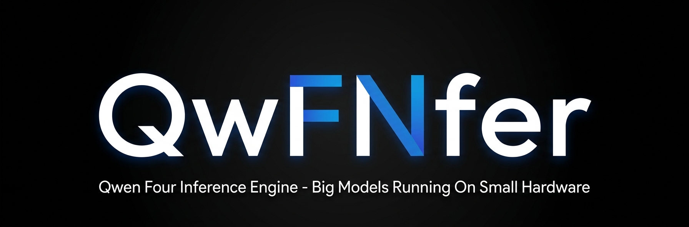

<div align="center">
  
  <p><b>Qwen3.8-Flash-Next, a 125B mixture-of-experts model with 512 experts, 111 GB on disk, at 160K context on one 16 GB GPU, 30 GB of RAM and an NVMe.</b></p>
</div>

<p align="center">
| <a href="#getting-started"><b>Getting Started</b></a> | <a href="#results"><b>Results</b></a> | <a href="#how-it-works"><b>How it works</b></a> | <a href="#built-around-the-qwen4-architecture"><b>Qwen4</b></a> | <a href="https://huggingface.co/unsloth/Qwen3.8-Flash-Next-GGUF"><b>Model (Unsloth GGUF)</b></a> |
</p>

Run a **125B** open-weight MoE on the gaming PC you already own, at interactive speed: **15–25 tok/s**.

## Updates

**2026-09-11** — (Experimental)The console now tunes itself to the machine it runs on: it measures the drive, sweeps the CPU thread count live on a long-context run, sizes the RAM tier from the memory the server really needs, defaults the KV cache to q8_0 wherever the plan affords it, and its Stats page is live (prefill progress, input / cached / output tokens). The numbers below were re-measured today with those defaults, and an OpenCode agentic-coding run was added.
Several optimizations and tweaks were introduced including fixing a MTP and vision bug.

## About

qwfnfer is a purpose-built inference engine for Qwen3.8-Flash-Next (GGUF architecture `qwen4exp`): 48 layers, 512 routed experts with top-10 routing, DeltaNet recurrent layers and Qwen Sparse Attention. It is not a llama.cpp fork. It uses ggml's quantized kernels and CUDA backend and llama.cpp's tokenizer, and owns everything above them: the model graph, the memory hierarchy, the expert cache, prefill, the server and the console. Its core features:

- **Three-tier expert runtime**: experts live in VRAM, in pinned RAM and on the NVMe. Reads happen at an expert's natural 0.6–1.2 MB size over io_uring/O_DIRECT (23× the bandwidth of 4 KiB demand paging on the same disk), VRAM-resident experts compute inside replayed CUDA graphs, and the next layer's routing is predicted from the residual and prefetched while the current layer computes.
- **Long context that stays flat**: 163,840 tokens with q8_0 KV on 16 GB (262,144 with the attention state in pinned RAM). Decode attention costs the same 0.55 ms per layer at 4K and at 160K (sparse attention over pooled block keys), and a layer-major prefill streams experts through VRAM at 350–590 tok/s depending on the batch instead of paging them.
- **OpenAI-compatible server**: streaming, thinking with `reasoning_effort` and a thinking budget, tool calling, vision, `/props`, `/stats`, `/slots`, `/metrics` and llama.cpp-style `timings`. Works with Unsloth Studio, Open WebUI or any OpenAI client.
- **Console**: a local page that finds the downloaded quants (the Hugging Face cache and any folder you add), sizes the flags for *your* GPU and RAM behind four tiers (Chat at 32K context, Agentic coding at 128K, Agentic coding+ at 256K, and a Custom tier you save), auto-tunes them on your hardware (the drive's read rate, a thread sweep on the running server, the KV precision the GPU has room for, the memory the RAM tier can take, then a measured verification), starts and stops the server, chats with it, and shows it live: prefill progress, input / cached / output tokens, tokens/s, the last request and the session's totals.
- **Measured, not projected**: the forward pass is validated bit-exact against llama.cpp, and every number here is a real run on the reference machine, same file, same settings.

## Results

<div align="center">
  
</div>

Reference machine: RTX 4080 SUPER 16 GB, 30 GB RAM, one NVMe. 163,840-token context and the console's plan for it (KV q8_0, batch 8192, indexer and KV cache in pinned RAM, speculative block, draft head and vision on), with a 15 GB RAM tier asked, 8 CPU threads and 768 MB of VRAM reserve; one run each through the server, measured 2026-09-11. The engine clamps the RAM tier to the memory the machine has: with the draft head's 2.7 GB of pinned experts it built 13.0 GB on Q4 (VRAM expert tier 8.1 GB, 2,591 experts) and 14.1 GB on Q3 (8.7 GB, 3,859 experts), and free memory went down to 1.0 and 0.4 GB at the worst point of the 155K-token prefill. The console's own sizing keeps 3 GB of headroom instead, a tier about 2 GB smaller (a GB of RAM tier is worth about 3% of decode).

| | UD-Q4_K_XL (111 GB) | UD-Q3_K_XL (90 GB) |
| --- | ---: | ---: |
| short chat, decode (thinking on) | 13.2–15.7 tok/s | 19.8–21.2 tok/s |
| 155K-token document: prefill | 355 tok/s (7.3 min) | 348 tok/s (7.4 min) |
| 155K-token document: decode, grounded answer | 12.9 tok/s | 17.7 tok/s |
| one 8,247-token answer at 160K context, sustained | 13.8 tok/s | not measured |
| llama.cpp on the same machine and file (measured 2026-09-06) | 1.4–2.2 tok/s chat, 3 tok/s prefill (Unsloth Studio's defaults) | 4.6–6.3 tok/s at long context |

The prefill runs at the batch the console picks for the context: it streams every expert once per batch and computes per token, so a bigger batch is a faster prefill (on a 43K-token document 4096 gives ~300 tok/s, 8192 ~480, 16384 ~720), and the console takes the largest batch whose VRAM the expert tier can lend while a prompt streams (8192 at 160K on 16 GB). Decode is unchanged either way.

The two options the console exposes, on the same Q4 file and settings; both are on by default:

| UD-Q4_K_XL, 160K context | short chat | 155K-token document, decode |
| --- | ---: | ---: |
| speculative block and draft head off | 13.3–13.5 tok/s | 11.7 tok/s |
| speculative block on, draft head off | 13.4–14.6 tok/s | 13.2 tok/s |
| both on (the console's defaults) | 13.2–15.7 tok/s | 12.9 tok/s |

The speculative block predicts the next layer's experts by running that layer's own block on the residual (95–96% right, against 80% for the router alone) and fetches them a layer early; the output is exact and it is worth 13% on the long document. The draft head is the checkpoint's own next-token predictor, verified by the trunk, so its output is the trunk's own; it pays in chat and in agentic coding (95% of drafts accepted in the OpenCode run below), while on a 155K-token document the tier it costs (0.35 GB of VRAM and 2.7 GB of pinned RAM, which here also meant a 13 GB arena instead of 15) cancels its gain. GPU decode varies about 5% run to run on identical work.

While it serves Q4 with the 13 GB arena: 29 of 31 GB of RAM in use system-wide (the engine 14.8 GB), 15.3 of 16 GB of VRAM, the GPU 50% busy, the engine on 2 of 16 threads.

**Agentic coding through OpenCode.** The same Q4 file driving a real coding harness: [OpenCode](https://opencode.ai) (`opencode run --auto`, tool calls auto-approved) is given a 40-line Python inventory module with two bugs and one missing method and its seven-case test suite, four cases failing, in a throwaway git repository, with this prompt:

> Some tests in test_inventory.py fail. Run the test suite, fix inventory.py so that every test passes without changing the tests, run the suite again to confirm, then reply with one line saying what you changed.

Server flags for this run: 262,144-token context, KV q4_0, a 15 GB RAM tier, 8 CPU threads, batch 16384, 768 MB of VRAM reserve, thinking `xhigh` with a 10,000-token budget, skip-miss off, speculative block on, draft head on, vision on, indexer and KV cache in pinned RAM. The engine built the full 15 GB arena and an 8.5 GB VRAM expert tier (2,730 experts). One run, measured 2026-09-11:

| OpenCode, UD-Q4_K_XL at 256K context | |
| --- | ---: |
| task solved (7 of 7 tests pass) | yes, in 5 steps and 6 tool calls (bash, bash, read, read, edit, bash) |
| wall time, prompt to final reply | 123 s |
| decode | 947 tokens at 14.0 tok/s |
| prefill | 10,209 new tokens at 188 tok/s; the 7,301-token first turn at 590 tok/s, every later step continuing the cached prefix (895 new tokens on 7,392 reused, 20 on 9,894 …) |
| draft head | 497 verify steps, 88.5% of drafts accepted |
| expert cache | 97.3% hit, 60.4% served from VRAM |

The harness reads the numbers from the server's own `/stats` around the run. What a coding step costs is mostly its prefill: a tool result of a few hundred tokens takes 7–10 s through the batched path, a longer one a full expert sweep (~12 s), and the decode of a 100–300-token tool call 7–20 s on top.

## Getting Started

Linux x86_64 with an NVIDIA GPU (driver 580 or newer) and Python 3, or Windows 10/11 x64 with an NVIDIA GPU (driver 580 or newer) and Python 3. On Windows the NVMe layer runs over unbuffered overlapped reads (`FILE_FLAG_NO_BUFFERING`) with the same slice granularity, alignment and bounce-buffer contract as Linux's io_uring; the io layer's tests (`qwfn-io-test`) run identically on both platforms.

**1. Install.** One command:

```bash
curl -fsSL https://raw.githubusercontent.com/Apolog1ze-Dev/QwFN/master/scripts/install.sh | bash
```

Or download `qwfnfer-linux-x86_64-cuda.zip` from the [Releases](https://github.com/Apolog1ze-Dev/QwFN/releases) page, unzip it anywhere and run `./qwfnfer`. The bundle carries the engine, the console and every library it needs (ggml, the CUDA runtime, liburing); only the NVIDIA driver comes from your system. The installer puts it under `~/.local/share/qwfnfer` and links `~/.local/bin/qwfnfer`; delete those two paths to uninstall.

**2. Get the model.** The console finds Qwen3.8-Flash-Next GGUFs in your Hugging Face cache. UD-Q4_K_XL is the quality choice, UD-Q3_K_XL the faster one; the `mmproj` file adds vision.

```bash
hf download unsloth/Qwen3.8-Flash-Next-GGUF --include "UD-Q4_K_XL/*" "mmproj-F16.gguf"
```

**3. Run it.**

```bash
qwfnfer
```

It opens <http://127.0.0.1:8090>. Pick a downloaded quant and a tier: **Chat** (32K context), **Agentic coding** (128K), **Agentic coding+** (256K, the model's full trained context) or **Custom** (anything you set under *Advanced settings* and save). Press **Auto-tune & start**: the console measures the drive under the model (random 2 MiB reads, the pattern of an expert miss), plans every flag for your GPU and RAM with that rate (context; the KV cache at q8_0 whenever the plan can afford it, q4_0 only where it would not fit; the expert tiers, the prefill batch the tier can lend, the reserve, where the attention caches live; vision on when the `mmproj` file is next to the model, the draft head on when its file is there), starts the server, verifies it on a short chat and a 16K–32K-token document with a passphrase planted in it (prefill and decode tokens/s, and whether the answer found the passphrase), sweeps the CPU thread count live on that document's context (the physical cores unless another count measures over 3% faster), and measures the memory the server needs besides its RAM tier through the run, then re-sizes the tier to leave exactly the headroom you set (3 GB by default; a GB of tier is about 3% of decode) and restarts with it. About five minutes; the result is saved per model, the tier card then shows the measured speed instead of the prediction, and every tier for that model uses the measured thread count and drive rate from then on. **Start server** starts with the plan alone; **Self-test** measures a running server. The banner names the model, the tier and every flag it is running with; the Chat, Stats and Log tabs talk to it. Stats is live at one second: the prefill's progress inside a batch with the time left, input / cached / output tokens for the running request, the last request in full (how much of its prompt was reused, prefill and decode speed, why it finished), the session's totals, the cache hit rate and the endpoint. *Model locations* under the model list adds any folder that holds the shards. `qwfnfer --start` starts the last served model and tier as the console comes up. Stop it from the same page.

<div align="center">
  
</div>

**4. Point your tools at it.** The console shows the endpoint, `http://127.0.0.1:8080/v1` by default; any OpenAI-compatible client works with any API key (Unsloth Studio as a custom provider, Open WebUI, your own scripts). What the server accepts:

- Chat completions with streaming; the model id is `qwen3.8-flash-next`. Images go in as OpenAI content parts (base64 `data:` URLs) when vision is on, up to 4,096 image tokens each; the projector runs on the CPU so it takes no VRAM; a 1400×1000 screenshot is 1,364 tokens and encodes in about 15 s on 8 cores, a 1280×720 one in 7-8 s.
- Thinking is `xhigh` by default; change it per request with `reasoning_effort` (`xhigh` | `medium` | `low` | `off`) or `reasoning_budget`, or with `/think` and `/no_think` in a message. Reasoning comes back separately in `reasoning_content`.
- Sampling presets follow the model card (thinking and non-thinking) unless you pass `temperature`, `top_p`, `top_k`, `min_p` or the penalties; tool calling follows the OpenAI `tools` / `tool_choice` shape, and a call streams as `tool_calls` deltas while the model is still writing it, so a harness sees the code arrive instead of a minutes-long silence (Unsloth Studio drops a stream after 300 s without bytes; the server also sends an SSE keepalive whenever nothing else has gone out for 15 s).
- Every response carries llama.cpp-style `timings`; `/stats` is what the console's live panel reads.
- One request at a time: the engine keeps a single context, and a conversation that continues the previous one only prefills its new turn.

**Building from source** (only if you want to change the engine). Needs CMake, Ninja, CUDA, and a built [llama.cpp](https://github.com/unslothai/llama.cpp) tree for the ggml backends and the tokenizer (default `~/.unsloth/llama.cpp`, override with `-DLLAMA_CPP_ROOT`); on Linux also liburing:

```bash
cmake -B build -G Ninja -DCMAKE_BUILD_TYPE=Release && cmake --build build -j && scripts/console.sh
```

On Windows (MSVC or clang-cl; CUDA with `-DCMAKE_CUDA_ARCHITECTURES` for your GPU):

```bat
cmake -B build -G Ninja -DLLAMA_CPP_ROOT=<path-to-llama.cpp> -DLLAMA_CPP_BUILD=<path-to-llama.cpp>\build\bin -DCMAKE_BUILD_TYPE=Release && cmake --build build -j && scripts\qwfnfer.cmd
```

`scripts\qwfnfer.cmd` is the Windows counterpart of the Linux `qwfnfer` launcher: it starts the console (or finds the one already running) and opens it in the browser; `python tools\qwfn_console.py` does the same without the browser handling. The ggml/llama DLLs are found next to the engine, in the engine's backend dir (`~/.unsloth/llama.cpp/build/bin`), or through `QWFN_BACKENDS`.

`qwfn-io-test` runs the io layer's tests on either platform (`build/qwfn-io-test` / `build\qwfn-io-test.exe`).

`scripts/package.sh` builds the relocatable bundle the installer downloads (`-DQWFN_PORTABLE=ON`: baseline x86-64-v3 code, libraries next to the binaries, the glibc floor of the machine it is built on, 2.35 from the release workflow), and `.github/workflows/release.yml` does the same on a tag push and attaches the zip to the release.

## How it works

Per decoded token the model touches about 1.1 GB of expert weights (48 layers × 10 experts); at 15 tok/s that is 16 GB/s, more than the NVMe delivers. The engine arranges for most of it to never leave the GPU:

1. **Expert slices are read whole**, 0.6–1.2 MB at a time over io_uring/O_DIRECT, instead of being demand-paged 4 KiB at a time through mmap.
2. **Three tiers with one policy**: a VRAM tier of ~2,600–3,900 experts at 160K context with the attention state in pinned RAM (8–9 GB on a 16 GB GPU), a pinned RAM arena sized from the memory the server leaves (13–15 GB on the reference machine, worth about +3% of decode per GB) and the NVMe; 95–99% of lookups hit and 62–77% are served from VRAM, depending on the quant and on the draft head's tier step.
3. **In-graph MoE**: VRAM-resident experts are computed inside each layer's replayed CUDA graph, with residency looked up on the device; experts fetched late are folded into the next graph.
4. **Speculative prefetch**: the next layer's routing is predicted by running that layer's own DeltaNet or attention block on the current residual inside the current layer's graph, state writes suppressed, and its experts are fetched while the current layer computes; the prediction is right for 95-96% of the next layer's experts (80% with the router alone), only the reads a token actually needs are waited for, and the output is exact.
5. **Flat decode at any context**: sparse attention over pooled block keys, F16 keys, q4_0 KV, which gives the same per-layer cost at 4K and at 160K.
6. **Layer-major prefill**: each layer's experts stream through VRAM in 16 MB chunks and sweep the whole batch; the tier lends the memory and takes it back.
7. **Measured against the reference**: bit-exact forward pass, in-process numeric checks, real chat workloads and replay files; GPU decode is nondeterministic, so nothing is judged on a single token diff.

## Built around the Qwen4 architecture

Qwen3.8-Flash-Next ships the Qwen4-generation design, `qwen4exp` in the GGUF, and the engine is shaped by what that checkpoint actually contains rather than by its parameter count:

- **48 layers, 36 Gated DeltaNet + 12 sparse attention** (every fourth layer), a residual of 4 hyper-connected streams, 512 routed experts with top-10 routing plus one shared expert, a lightning indexer (4 × 128, top-2048) with 4-way pooled keys, and a 51B-parameter per-layer n-gram embedding table (PLE), 28.8 GB on its own.
- **Placement follows the shape.** The dense core (about 5 GB) is resident in VRAM. The routed experts are the only weights that need bandwidth, so they get the three-tier cache. The PLE table stays on the NVMe: a token reads 16 rows of 90 bytes from it (181 µs), so the largest tensor in the file costs no RAM at all.
- **The hybrid layer mix is what makes decode flat.** DeltaNet layers carry a fixed recurrent state and no KV, so their decode graphs reference nothing that changes with position and replay as CUDA graphs; the 12 attention layers select over pooled block keys, so their cost does not grow with context up to the trained 262K.
- **The MoE's routing skew is what makes a small GPU enough.** With 512 fine-grained experts and 10 active, routing is far from uniform, so a VRAM tier of ~2,600–3,900 experts serves 62–77% of lookups at 160K context, and the next layer's routing can be computed a layer early by running its block on the residual stream and prefetched while the current layer runs.
- **The model card is followed** for the thinking template, the tool-call format, mrope for images and the sampling presets; the forward pass is checked node by node against llama.cpp's `qwen4exp`, which matters because this architecture is unusually sensitive to accumulation order.

**What this means for the next Qwen releases.** Every hyper-parameter the engine uses is read from the GGUF metadata (layer count and interval, expert count and top-k, indexer geometry, DeltaNet sizes, PLE geometry, context and rope). Nothing is hard-coded to this checkpoint. A future checkpoint built from the same blocks at a different size (more experts, more layers, a bigger PLE, a longer context) is a metadata change; a new block is a graph change, validated against the reference the same way. What the engine needs from the hardware is set by the *active* path per token and by the tiers you can afford, not by the file size: the dense core and the KV/indexer state must fit in VRAM, and everything else streams through cache tiers sized to the GPU and RAM present. The console's cost model does that sizing for whatever machine it finds. Two things are still on the list: the checkpoint's multi-token-prediction head (the *Draft head* setting: the trunk verifies every draft, so the output is its own) pays in chat and in agentic coding but not yet on a 155K-token document, and the tiers have only been measured on the 16 GB / 30 GB reference machine; the console's auto-tune is what carries the sizing to other machines.

## Acknowledgment

Built on [ggml](https://github.com/ggml-org/ggml) (quantized kernels, CUDA backend) and [llama.cpp](https://github.com/ggml-org/llama.cpp) (tokenizer, and the bit-exact reference the forward pass is validated against). Model: Qwen3.8-Flash-Next by the [Qwen](https://huggingface.co/Qwen) team; quantized GGUFs by [Unsloth](https://huggingface.co/unsloth/Qwen3.8-Flash-Next-GGUF), whose Studio served as the harness for testing.

## License

[Apache License 2.0](LICENSE).
